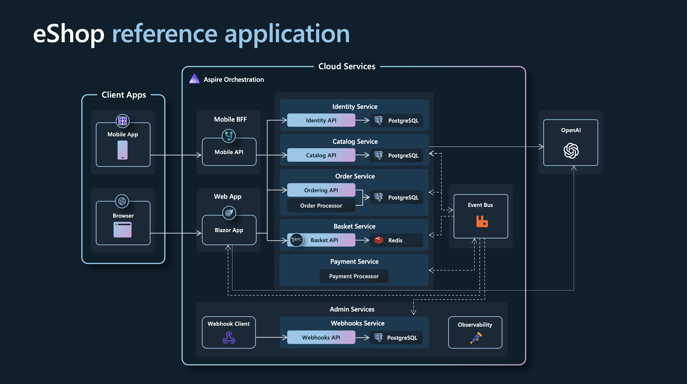
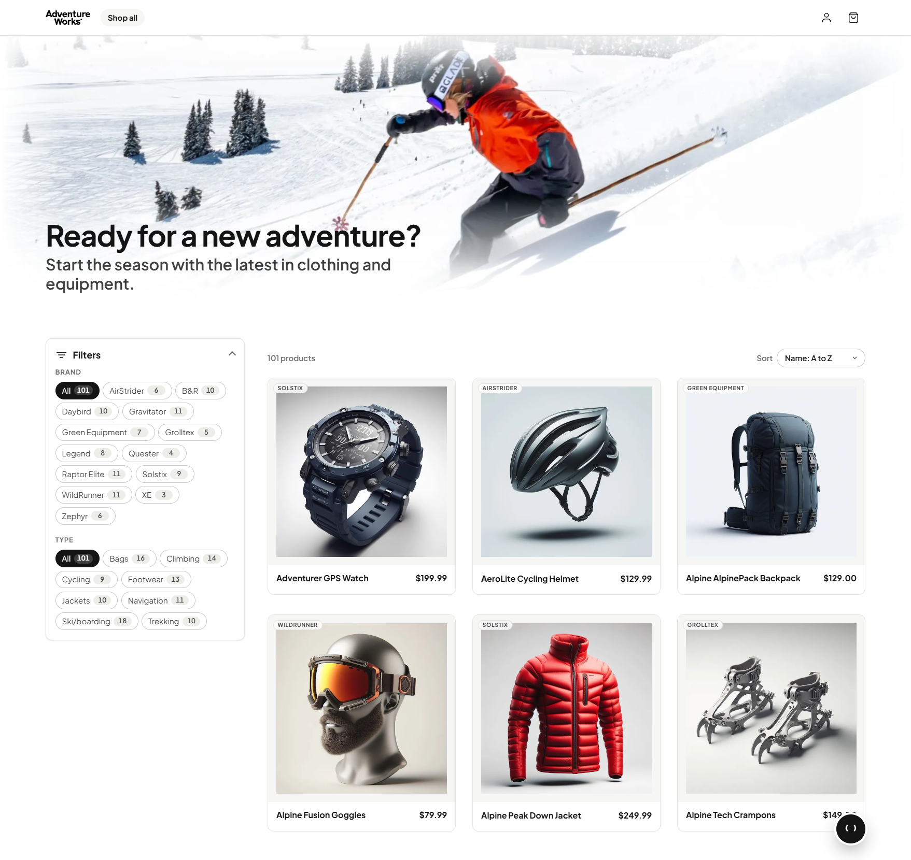

# ShreyShop

Personalized project edition by **Shreyjeetsinh Dodiya**.

[Developer profile](https://www.linkedin.com/in/shreyjeetsinh/)

Based on the [eShop reference application](https://github.com/dotnet/eShop). Original copyright and license notices are preserved in [LICENSE](LICENSE).

A reference .NET application implementing an e-commerce website using a services-based architecture with [Aspire](https://aspire.dev/).

Original upstream architecture diagram (service names precede this rebrand):



The following screenshot shows the original upstream interface, before ShreyShop branding:



## Getting Started

This version of ShreyShop is based on .NET 10.

Previous ShreyShop versions:

* [.NET 8](https://github.com/dotnet/eShop/tree/release/8.0)

### Prerequisites

1. Install a [.NET 10 SDK](https://dotnet.microsoft.com/download/dotnet/10.0) that satisfies [`global.json`](global.json).
2. Install the [Aspire CLI](https://aspire.dev/get-started/install-cli/) and verify that it is available:

    ```console
    aspire --version
    ```

3. Install and start an OCI-compatible container runtime. [Docker Desktop](https://www.docker.com/products/docker-desktop/) is the recommended default. [Podman](https://podman.io/docs/installation) is also supported; follow the [Aspire prerequisites](https://aspire.dev/get-started/prerequisites/) to configure it.
4. Extract `ShreyShop.zip` and open its `ShreyShop` folder:

    ```console
    cd ShreyShop
    ```

No separate Aspire workload or Visual Studio component is required; the AppHost SDK and hosting integrations are referenced by the projects in this repository.

#### Optional IDE setup

- [Visual Studio](https://visualstudio.microsoft.com/vs/) with the `ASP.NET and web development` workload.
- [Visual Studio Code with C# Dev Kit](https://code.visualstudio.com/docs/csharp/get-started) and the [Aspire extension](https://aspire.dev/get-started/aspire-vscode-extension/).
- The [.NET MAUI workload](https://learn.microsoft.com/dotnet/maui/get-started/installation) if you want to run the client apps.

### Running the solution

> [!WARNING]
> Ensure that your container runtime is running before starting ShreyShop.

#### From the terminal

From the repository root, run:

```console
aspire run
```

The root [`aspire.config.json`](aspire.config.json) selects `src/ShreyShop.AppHost/ShreyShop.AppHost.csproj`, avoiding ambiguity with the test AppHosts in the repository. When startup completes, the CLI prints a dashboard URL similar to:

```text
Dashboard: https://localhost:<port>/login?t=<token>
```

Press <kbd>Ctrl</kbd>+<kbd>C</kbd> to stop the AppHost. See the [`aspire run` command](https://aspire.dev/reference/cli/commands/aspire-run/) for additional options.

To run the AppHost in the background instead:

```console
aspire start
aspire ps
```

When you are finished, run `aspire stop`. See the [`aspire start` command](https://aspire.dev/reference/cli/commands/aspire-start/) for details.

#### From Visual Studio

1. Open `ShreyShop.Web.slnf`.
2. Set `src/ShreyShop.AppHost/ShreyShop.AppHost.csproj` as the startup project.
3. Press <kbd>Ctrl</kbd>+<kbd>F5</kbd> to start ShreyShop and open the Aspire dashboard.

### Running tests

Run the server tests:

```powershell
dotnet test --solution ShreyShop.Web.slnf
```

Run the Playwright browser journeys. Playwright starts the AppHost automatically, so ensure your container runtime is running first.

```powershell
npm ci
npx playwright install chromium
npm run test:e2e
```

### Optional: AI Chatbot with Microsoft Foundry

This option provisions a Microsoft Foundry resource during local development, so first authenticate to Azure and configure the subscription and location:

```powershell
az login
aspire secret set "Azure:SubscriptionId" "<subscription-id>"
aspire secret set "Azure:Location" "eastus"
```

Then enable Foundry and start ShreyShop:

```powershell
$env:UseFoundry = "true"
aspire run
```

Aspire provisions the `gpt-4.1-mini` and `text-embedding-3-small` deployments and injects their connection information into the consuming projects. The Foundry hosting integration currently uses a preview package. See [local Azure provisioning](https://aspire.dev/integrations/cloud/azure/local-provisioning/) and the [Microsoft Foundry hosting integration](https://aspire.dev/integrations/cloud/azure/azure-ai-foundry/azure-ai-foundry-host/) for details.

### Deploy to Azure Container Apps

The AppHost is already configured with an Azure Container Apps environment, so the Aspire CLI can deploy directly from the application model. See the [Aspire Azure Container Apps deployment guide](https://aspire.dev/deployment/azure/container-apps/) for details.

> [!WARNING]
> This sample deploys PostgreSQL, Redis, and RabbitMQ as containers in Azure Container Apps. This configuration is intended for evaluation and demonstrations, not production data.

Prerequisites:

- The prerequisites listed above, including a running container runtime.
- The [Azure CLI](https://learn.microsoft.com/cli/azure/install-azure-cli), an active Azure subscription, and permission to create resources.

Sign in, optionally preview the deployment pipeline, and deploy:

```console
az login
aspire deploy --list-steps
aspire deploy
```

For local interactive use, `aspire deploy` prompts for missing Azure settings. For non-interactive use, provide them explicitly:

```powershell
$env:Azure__SubscriptionId = "<subscription-id>"
$env:Azure__Location = "eastus"
$env:Azure__ResourceGroup = "rg-shreyshop-demo"
aspire deploy --non-interactive
```

Use [`aspire publish`](https://aspire.dev/reference/cli/commands/aspire-publish/) when you need deployment artifacts for inspection or another deployment tool. Running it first is not required: `aspire deploy` invokes the deployment pipeline and its dependencies directly rather than consuming an earlier publish output.

When you no longer need the deployment, run [`aspire destroy`](https://aspire.dev/reference/cli/commands/aspire-destroy/). This deletes the entire configured resource group, including resources that Aspire did not create, so review the target carefully before confirming.

## Contributing

For more information on contributing to this repo, read [the contribution documentation](./CONTRIBUTING.md) and [the Code of Conduct](CODE-OF-CONDUCT.md).

### Sample data

The sample catalog data is defined in [catalog.json](src/Catalog.API/Setup/catalog.json). Those product names, descriptions, and brand names are fictional and were generated using [GPT-35-Turbo](https://learn.microsoft.com/en-us/azure/ai-services/openai/how-to/chatgpt), and the corresponding [product images](src/Catalog.API/Pics) were generated using [DALL·E 3](https://openai.com/dall-e-3).

## ShreyShop on Azure

For a version of this app configured for deployment on Azure, please view [the ShreyShop on Azure](https://github.com/Azure-Samples/eShopOnAzure) repo.
